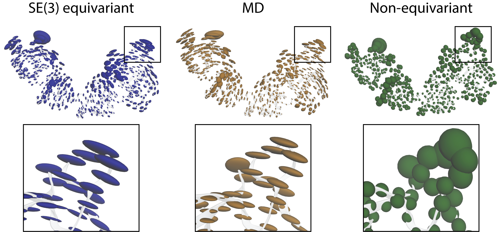
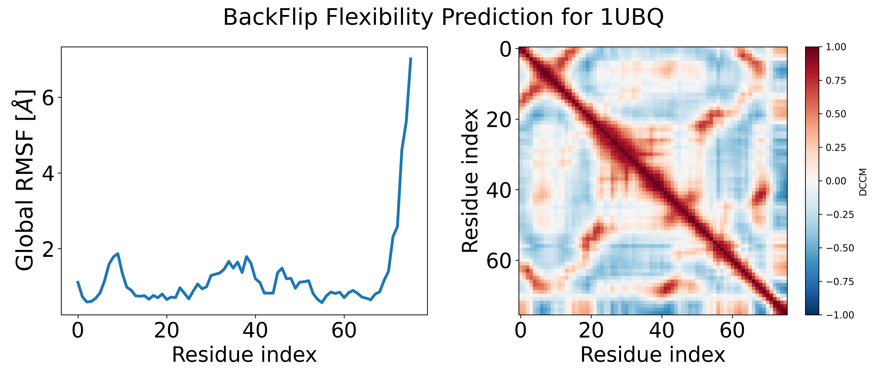

# BackFlip 2: Backbone Flexibility Predictor


## Description

BackFlip is an equivariant model trained to predict **directional per-residue backbone flexibility and dynamic pairwise residue couplings** of protein structures described in the paper [Predicting directional flexibility in proteins](https://arxiv.org/abs/2609.08474). This repository relies on a copy of [OpenFold](https://github.com/aqlaboratory/openfold) (via [GAFL](https://github.com/hits-mli/gafl)) and code from [FrameFlow](https://github.com/microsoft/protein-frame-flow).


<em>BackFlip is an equivariant model that captures directionality (anisotropy) of flexibility, as observed in MD. The non-equivariant model is only capable of predicting non-directional (isotropic) flexibility.
</em>

---

## Table of contents 

- [TODO](#todo)
- [Colab Tutorial](#colab-tutorial)
- [Inference](#inference)
- [Installation](#installation)
- [Dataset](#dataset)
- [Training](#training)
- [Citation](#citation)

## TODO

- [x] Replace the `backflip-1.0`/`backflip-1.0-seq` checkpoint downloads with versions matching the current model and output keys (`per_res_covariance`, `pairwise_couplings`, `pairwise_DCCM`): added `backflip-2.1` (ATLAS), `backflip-2.1-mdcath`, `backflip-2.1-joint`.
- [x] Remove attn_maps and pairfeats of ESMf from the dataset
- [x] Upload and link the updated datasets (ATLAS, mdCATH, and the joint ATLAS+mdCATH split) with the renamed features and update the corresponding readme section
- [x] Finish instructive_examples.py; now loads from a tag
- [x] update test equivariance for the tag
- [x] Update the Colab tutorial to match the current inference outputs
- [x] Update citation for the arxiv link once published and description
- [x] train with newly refactored code

## Colab Tutorial

We provide an instructive [Google Colab tutorial for predicting the flexibility of ubiquitin](https://colab.research.google.com/drive/1nBz26gv7EVa8CxkbuNal6ndGzHZbwqHt?usp=sharing) that requires no local installation. Go ahead and try out BackFlip for your favorite protein!

## Inference

<!-- We provide two pretrained model checkpoints as tags ```backflip-1.0``` that is trained entirely independent of sequence information and ```backflip-1.0-seq``` that has a one-hot sequence encoding and performs slightly better. -->

We provide three pretrained model checkpoints as tags: ```backflip-2.1``` (trained on ATLAS), ```backflip-2.1-mdcath``` (trained on mdCATH) and ```backflip-2.1-joint``` (trained on the joint ATLAS + mdCATH split). All three take backbone frames plus one-hot amino-acid type and predict `per_res_covariance`, `pairwise_couplings` and `pairwise_DCCM`. ```backflip-2.1``` is the default, i.e. `tag='latest'`.

### Using BackFlip directly in python

```python
from backflip.deployment.inference_class import BackFlip
from backflip.data.flexibility_utils import batched_rmsf_from_covar

# Load backflip model from tag:
bf = BackFlip.from_tag(tag='backflip-2.1', device='cpu')

# run backflip
prediction = bf.predict_from_pdb(pdb_path='./test_data/inference_examples/from_pdb_folder/1ubq.pdb')
```
This returns a dictionary with three predicted edge features: 
- `per_res_covariance`, the (N, 3, 3) anisotropic covariance of each residue's own fluctuations 
- `pairwise_couplings`, the (N, N) raw CA-CA covariance between residue pairs and
- `pairwise_DCCM`, the dynamic cross-correlation matrix derived from `pairwise_couplings` (values in [-1, 1]). 
- The familiar isotropic global RMSF profile is derived from `per_res_covariance`:

```python
global_rmsf = batched_rmsf_from_covar(prediction['per_res_covariance'])[0]
```


<em>
Global RMSF (derived from the predicted per-residue covariance) and the predicted dynamic cross-correlation matrix (DCCM) for ubiquitin (1UBQ). Entries close to +1 in the DCCM indicate residues that move in a correlated fashion, entries close to -1 indicate anticorrelated motion.</em>

### Command line interface

BackFlip comes with two commands for inference:

1. `backflip-predict`: Predict per-residue flexibility for a single protein, e.g.:

```bash
# write the isotropic RMSF profile to a TXT file
backflip-predict 1ubq.pdb --tag backflip-2.1 --output 1ubq_global_rmsf.txt
# or write it as a B-factor into a new CIF file
backflip-predict 1ubq.pdb --tag backflip-2.1 --output 1ubq_global_rmsf.cif --rmsf-as-bfactor
```

2. `backflip-annotate`: Efficiently annotate a folder of pdb/cif files with predicted per-residue covariance, optionally also writing the isotropic RMSF as a B-factor into CIF files (`--rmsf-as-bfactor`). As explained in [Dataset annotation](#dataset-annotation) below, this always writes a `npz/` subfolder with the raw predictions, and additionally a `cifs/` subfolder with the B-factor-annotated CIF files if `--rmsf-as-bfactor` is set.

See `scripts/cmd_line_example.sh` for an example script demonstrating the command line interface.

### Dataset annotation

BackFlip is suited for large scale flexibility annotation of proteins, in the batched mode explained below it can achieve inference speeds of about 50 proteins per second on a single NVIDIA A100 GPU.
Inference on an example folder containing .pdb files:

```python
from backflip.deployment.inference_class import BackFlip
from pathlib import Path

# Inference on the folder containing .pdb files.
pdb_folder_test = Path('./test_data/inference_examples/from_pdb_folder').resolve()

# Download model weights and load backflip model from tag:
bf = BackFlip.from_tag(tag='backflip-2.1', device='cuda', progress_bar=True)

# Predict per-residue covariance/couplings for every file, and also write the isotropic
# RMSF as a B-factor into a .cif file:
bf.predict(input_path=pdb_folder_test, cuda_memory_GB=8, rmsf_as_bfactor=True)
```

By default (`overwrite=False`), this writes into an `inference_results` folder next to the inputs (or into `output_folder` if given). Inside it, a `npz/` subfolder is always created, holding one `*_pred.npz` file per input with the raw `per_res_covariance`/`pairwise_couplings`/`pairwise_DCCM` predictions. A `cifs/` subfolder is created only if `rmsf_as_bfactor=True`, holding one `.cif` file per input with the isotropic global RMSF (derived from `per_res_covariance`) written into the B-factor column. If `rmsf_as_bfactor=False` (the default), no `cifs/` folder is written.

We recommend running inference with BackFlip given a folder containing .pdb or .cif files as input. You can also point just to the structural file itself. For more details and brief analyses we refer to the example inference script available at `scripts/instructive_examples.py`.

### Evaluating checkpoints
We provide an evaluation script at `backflip/analyses/analyse_backflip.py` that compares BackFlip predictions against a ground-truth dataset (as produced by `scripts/dataset/generate_dataset.py`, e.g. the ATLAS dataset we provide below) and reports RMSF, DCCM, and covariance-ellipsoid overlap metrics.

First run inference to produce `*_pred.npz` files, e.g. via `backflip-annotate` or `BackFlip.predict(...)`, then run:

```bash
python backflip/analyses/analyse_backflip.py \
    --inference_folder /path/to/inference_results/npz \
    --gt_npz_folder /path/to/ground_truth_dataset \
    --output_csv metrics.csv
```

This prints metrics reported in the paper across all matched proteins, and optionally saves the full per-protein metrics table to `--output_csv`.

### Equivariance of predicted covariance matrices

BackFlip predicts an equivariant directional (anisotropic) per-residue covariances(`per_res_covariance`): rotating the input structure rotates the predicted covariance matrices accordingly. This can be verified with `scripts/covar_analyses/equivariance_test.py`.

---

## Installation

### Installation script

You can use our install script (here for python 3.12, torch version 2.6.0, cuda 12.4), which essentially executes the steps specified in the section **pip** below:

```bash
git clone https://github.com/graeter-group/backflip.git
conda create -n backflip python=3.12 -y
conda activate backflip && bash backflip/install_utils/install_via_pip.sh 2.6.0 124 3.12 # torch-ver, cuda-ver and python-ver as args
```

Verify your installation by running our example script:

```bash
cd backflip/ && python backflip/scripts/minimal_inference.py
```

### pip

Optional: Create a virtual environment, e.g. with conda, and install pip23.2.1:

```bash
conda create -n backflip python=3.12 pip=23.2.1 -y
conda activate backflip
```

Install the dependencies from the requirements file:

```bash
git clone https://github.com/graeter-group/backflip.git
pip install -r backflip/install_utils/requirements.txt

# Install backflip with pip (this also installs the vendored openfold package):
cd backflip
pip install -e .
```

Install torch with a suitable cuda version, e.g.

```bash
pip install torch==2.6.0 --index-url https://download.pytorch.org/whl/cu124
pip install torch-scatter -f https://data.pyg.org/whl/torch-2.6.0+cu124.html
```

where you can replace cu124 by your cuda version, e.g. cu118 or cu121.

### conda

The dependencies are listed in `install_utils/environment.yaml`, we also provide a minimal environment in `install_utils/minimal_env.yaml`, where it is easier to change torch/cuda versions.

```bash
# download backflip:
git clone https://github.com/graeter-group/backflip.git
# create env with dependencies:
conda env create -f backflip/install_utils/minimal_env.yaml
conda activate backflip

# install backflip (this also installs the vendored openfold package):
cd backflip
pip install -e .
```

### Common installation issues

Problems with torch_scatter can usually be resolved by uninstalling and re-installing it via pip for the correct torch and cuda version, e.g. `pip install torch-scatter -f https://data.pyg.org/whl/torch-2.0.0+cu124.html` for torch 2.0.0 and cuda 12.4.

---
## Dataset

We provide the ATLAS dataset [2] with precomputed per-residue covariance and pairwise coupling features used for training and evaluation of BackFlip. To download the dataset, run:

```bash
wget --content-disposition https://keeper.mpdl.mpg.de/f/0ebae6ed7c0c42beb778/?dl=1
```

Both data splits as in FlexPert [1] and for the model reported in the ICML 2025 paper can be found in the downloaded compressed dataset folder. Note that the latest model, BackFlip-1.0 was trained on the flexpert dataset split. Before training or evaluating the model, the paths pointing to the corresponding .npz files need to be changed to absolute paths on the local machine. This can be done by running:

```bash
tar -xvf ATLAS_backflip_release.tar
python scripts/rename_csv_paths.py ATLAS-v5-mean_rmsf/flexpert_test.csv ATLAS-v5-mean_rmsf/flexpert_train.csv ATLAS-v5-mean_rmsf/flexpert_val.csv
```

**Note:** The dataset is a modified version of the ATLAS dataset (adds precomputed per-residue covariance and pairwise coupling features). ATLAS is licensed **CC BY-NC 4.0**; attribution required; **non-commercial use only**. See [2] and the upstream license.

### Datasets for the `backflip-2.1` models

The `backflip-2.1*` checkpoints were trained on the datasets below, with the renamed
features (`per_res_covariance`, `pairwise_couplings`, `pairwise_DCCM`). Each archive
unpacks to a folder of per-protein `.npz` files (except the joint split, which only
contains the split-definition CSVs and references the `.npz` files from the other two).

```bash
# ATLAS train split (~4.9 GB)      -> used for  backflip-2.1
wget -O backflip_atlas_train.tar "https://keeper.mpdl.mpg.de/f ed58d96c50a74513a432/?dl=1"

# mdCATH dataset (~11.3 GB)        -> used for  backflip-2.1-mdcath
wget -O backflip_mdcath_dataset.tar "https://keeper.mpdl.mpg.de/f/24517dcb594e41279e1c/?dl=1"

# joint ATLAS + mdCATH split CSVs  -> used for  backflip-2.1-joint
wget -O backflip_atlas_mdcath_joint_dataset.tar "https://keeper.mpdl.mpg.de/f/316a89a9627842ec9f40/?dl=1"
```

As above, after `tar -xvf <archive>` update the paths in the split CSVs to absolute local paths with `python scripts/rename_csv_paths.py <csv> ...` before training or evaluating.

## Training

To train a model to predict per-residue covariance and pairwise couplings on the dataset we provide, run:

```python
python experiments/train.py --config-path ../configs --config-name train data.dataset.train_csv_path=/<path_to_train_csv> data.dataset.val_csv=/<path_to_val_csv> data.dataset.test_csv=/<path_to_test_csv> 
```

See ```configs/experiment/default.yaml``` for all arguments.

---

## Citation

```
@unpublished{viliuga2026backflip,
      title={Predicting directional flexibility in proteins}, 
      author={Vsevolod Viliuga and Leif Seute and Matteo Tadiello and Nicolas Wolf and Frauke Gräter and Arne Elofsson},
      year={2026},
      eprint={2609.08474},
      archivePrefix={arXiv},
      primaryClass={q-bio.BM},
      url={https://arxiv.org/abs/2609.08474}, 
}

@inproceedings{
viliuga2025flexibilityconditioned,
title={Flexibility-conditioned protein structure design with flow matching},
author={Vsevolod Viliuga and Leif Seute and Nicolas Wolf and Simon Wagner and Arne Elofsson and Jan St{\"u}hmer and Frauke Gr{\"a}ter},
booktitle={Forty-second International Conference on Machine Learning},
year={2025},
url={https://openreview.net/forum?id=890gHX7ieS}
}
```

## References

[1] Kouba, Petr et al. "Learning to engineer protein flexibility." arXiv preprint arXiv:2412.18275 (2024).

[2] ATLAS dataset: [Link to upstream source](https://www.dsimb.inserm.fr/ATLAS). License: CC BY-NC 4.0.

[3] Jing, Bowen et al. "AlphaFold meets flow matching for generating protein ensembles." arXiv preprint arXiv:2402.04845 (2024).