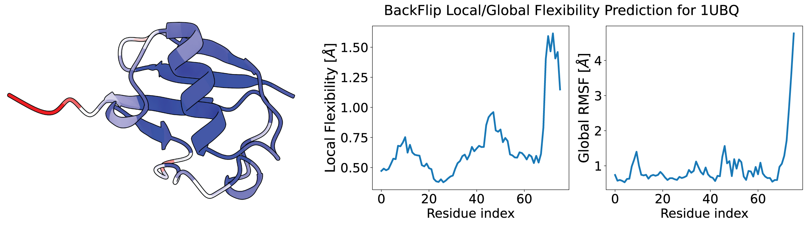
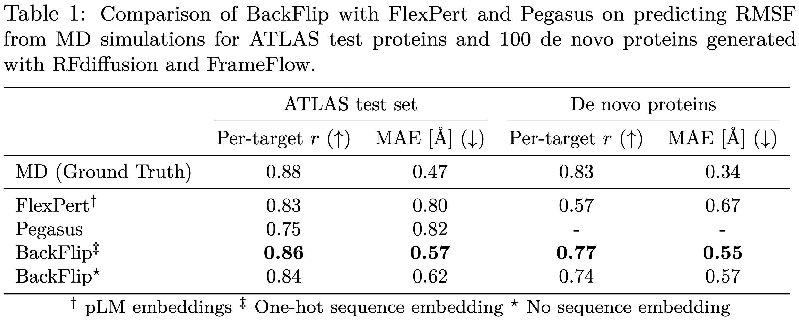

# BackFlip - Backbone Flexibility Predictor


## Description

BackFlip is a model trained to predict **per-residue backbone flexibility** of protein structures described in the paper [Flexibility-conditioned protein structure design with flow matching](https://openreview.net/forum?id=890gHX7ieS).

This repository relies on the [GAFL](https://github.com/hits-mli/gafl) package and code from [FrameFlow](https://github.com/microsoft/protein-frame-flow).

---

## Table of contents 

- [Colab Tutorial](#colab-tutorial)
- [Inference](#inference)
- [Installation](#installation)
- [Dataset](#dataset)
- [Training](#training)
- [Citation](#citation)


## Colab Tutorial

We provide an instructive [Google Colab tutorial for predicting the flexibility of ubiquitin](https://colab.research.google.com/drive/1nBz26gv7EVa8CxkbuNal6ndGzHZbwqHt?usp=sharing) that requires no local installation. Go ahead and try out BackFlip for your favorite protein!

## Inference

We provide two pretrained model checkpoints as tags ```backflip-1.0``` that is trained entirely independent of sequence information and ```backflip-1.0-seq``` that has a one-hot sequence encoding. We find that ```backflip-1.0-seq``` performs slightly better on all metrics. For comparison, please see the table with metrics we report below.

### Command line interface

BackFlip comes with two commands for inference:

1. `backflip-predict`: Predict per-residue flexibility for a single protein and store it as b factor in a pdb file, e.g.:

```bash
backflip-predict 1ubq.pdb --tag backflip-1.0 --output 1ubq_global_rmsf.pdb
```

2. `backflip-annotate`: Efficiently annotate a folder of pdb files with predicted flexibility.

See `scripts/cmd_line_example.sh` for an example script demonstrating the command line interface.


### Using BackFlip directly in python

```python
from backflip.deployment.inference_class import BackFlip

# Load backflip model from tag:
bf = BackFlip.from_tag(tag='backflip-1.0', device='cpu')

# run backflip
prediction = bf.predict_from_pdb(pdb_path='./test_data/inference_examples/from_pdb_folder/1ubq.pdb')
```
This will return a dictionary with local and global flexibility.


<em>
Local flexibility and global RMSF for ubiquitin (1UBQ), predicted by BackFlip with the above code snippet. BackFlip predicts the alpha helix as locally stiff, the beta sheet as slightly more flexible, and the C-terminus as very flexible.</em>

### Dataset annotation

BackFlip is suited for large scale flexibility annotation of proteins, in the batched mode explained below it can achieve inference speeds of about 50 proteins per second on a single NVIDIA A100 GPU.
Inference on an example folder containing .pdb files:

```python
from backflip.deployment.inference_class import BackFlip
from pathlib import Path

# Inference on the folder containing .pdb files.
pdb_folder_test = Path('./test_data/inference_examples/from_pdb_folder').resolve()

# Download model weights and load backflip model from tag:
bf = BackFlip.from_tag(tag='backflip-1.0', device='cuda', progress_bar=True)

# Predict and write local RMSF as a b-factor to the pdb files
bf.predict(pdb_folder=pdb_folder_test,cuda_memory_GB=8)
```

We recommend running inference with BackFlip given a folder containing .pdb or .cif files as input. You can also point just to the structural file itself. For more details and brief analyses we refer to the example inference script available at `scripts/instructive_examples.py`.

### Evaluating checkpoints
We provide an evaluation script at `experiments/inference_csv.py` that can be used to evaluate BackFlip on a dataset split as the ATLAS dataset we provide below. If you follow the steps below, you can evaluate BackFlip-1.0 on the FlexPert dataset split by running:

```bash
python experiments/inference_csv.py ATLAS-v5-mean_rmsf/flexpert_test.csv --tag backflip-1.0
```

### Compute local or global RMSF

We provide a detailed explanation on how to compute local or global RMSF in `scripts/example_rmsf.py`.

### Comparison of BackFlip’s performance with other DL-based flexibility prediction models

We trained BackFlip-1.0 on the same dataset split (and global RMSF definition) as in FlexPert [1] and report the metrics in the table below. We compare with the recent FlexPert [1] and PEGASUS [2] models.



---

## Installation

### Installation script

You can use our install script (here for python 3.12, torch version 2.6.0, cuda 12.4), which essentially executes the steps specified in the section **pip** below:

```bash
git clone https://github.com/graeter-group/backflip.git
conda create -n backflip python=3.12 -y
conda activate backflip && bash backflip/install_utils/install_via_pip.sh 2.6.0 124 3.12 # torch-ver, cuda-ver and python-ver as args
```

Verify your installation by running our example script:

```bash
cd backflip/ && python backflip/scripts/minimal_inference.py
```

### pip

Optional: Create a virtual environment, e.g. with conda, and install pip23.2.1:

```bash
conda create -n backflip python=3.12 pip=23.2.1 -y
conda activate backflip
```

Install the dependencies from the requirements file:

```bash
git clone https://github.com/graeter-group/backflip.git
pip install -r backflip/install_utils/requirements.txt

# BackFlip builds on top of the GAFL package, which is installed from source:
git clone https://github.com/hits-mli/gafl.git
cd gafl
bash install_gatr.sh # Apply patches to gatr (needed for gafl)
pip install -e . # Install GAFL
cd ..

# Finally, install backflip with pip:
cd backflip
pip install -e .
```

Install torch with a suitable cuda version, e.g.

```bash
pip install torch==2.6.0 --index-url https://download.pytorch.org/whl/cu124
pip install torch-scatter -f https://data.pyg.org/whl/torch-2.6.0+cu124.html
```

where you can replace cu124 by your cuda version, e.g. cu118 or cu121.

### conda

FliPS relies on the [GAFL](https://github.com/hits-mli/gafl) package, which can be installed from GitHub as shown below. The dependencies besides GAFL are listed in `install_utils/environment.yaml`, we also provide a minimal environment in `install_utils/minimal_env.yaml`, where it is easier to change torch/cuda versions.

```bash
# download backflip:
git clone https://github.com/graeter-group/backflip.git
# create env with dependencies:
conda env create -f backflip/install_utils/minimal_env.yaml
conda activate backflip

# install gafl:
git clone https://github.com/hits-mli/gafl.git
cd gafl
bash install_gatr.sh # Apply patches to gatr (needed for gafl)
pip install -e .
cd ..

# install backflip:
cd backflip
pip install -e .
```

### Common installation issues

Problems with torch_scatter can usually be resolved by uninstalling and re-installing it via pip for the correct torch and cuda version, e.g. `pip install torch-scatter -f https://data.pyg.org/whl/torch-2.0.0+cu124.html` for torch 2.0.0 and cuda 12.4.

---

## Dataset

We provide the ATLAS dataset [3] with global_rmsf and local_flex features used for training and evaluation of BackFlip. To download the dataset, run:

```bash
wget --content-disposition https://keeper.mpdl.mpg.de/f/0ebae6ed7c0c42beb778/?dl=1
```

Both data splits as in FlexPert [1] and for the model reported in the ICML 2025 paper can be found in the downloaded compressed dataset folder. Note that the latest model, BackFlip-1.0 was trained on the flexpert dataset split.
Before training or evaluating the model, the paths pointing to the corresponding .npz files need to be changed to absolute paths on the local machine. This can be done by running:

```bash
tar -xvf ATLAS_backflip_release.tar
python scripts/rename_csv_paths.py ATLAS-v5-mean_rmsf/flexpert_test.csv ATLAS-v5-mean_rmsf/flexpert_train.csv ATLAS-v5-mean_rmsf/flexpert_val.csv
```

**Note:** The dataset is a modified version of the ATLAS dataset (adds precomputed `global_rmsf` and `local_flex`). ATLAS is licensed **CC BY-NC 4.0**; attribution required; **non-commercial use only**. See [4] and the upstream license.

## Training

To train a model to predict global RMSF and local flexibility on the dataset we provide, run:

```python
python experiments/train.py --config-path ../configs --config-name train data.dataset.train_csv_path=/<path_to_train_csv> data.dataset.val_csv=/<path_to_val_csv> data.dataset.test_csv=/<path_to_test_csv> 
```

See ```configs/experiment/default.yaml``` for all arguments.

---

## Citation

```
@inproceedings{
viliuga2025flexibilityconditioned,
title={Flexibility-conditioned protein structure design with flow matching},
author={Vsevolod Viliuga and Leif Seute and Nicolas Wolf and Simon Wagner and Arne Elofsson and Jan St{\"u}hmer and Frauke Gr{\"a}ter},
booktitle={Forty-second International Conference on Machine Learning},
year={2025},
url={https://openreview.net/forum?id=890gHX7ieS}
}
```

The code relies on the [GAFL](https://github.com/hits-mli/gafl) package and code from [FrameFlow](https://github.com/microsoft/protein-frame-flow). It would be appreciated if you also cite the two respective papers if you use the code.

## References

[1] Kouba, Petr, et al. "Learning to engineer protein flexibility." arXiv preprint arXiv:2412.18275 (2024).

[2] Vander Meersche, Yann, et al. "PEGASUS: Prediction of MD‐derived protein flexibility from sequence." Protein Science 34.8 (2025).

[3] Vander Meersche, Y., Cretin, G., Gheeraert A., Gelly, J. C., & Galochkina, T. (2023). ATLAS: protein flexibility description from atomistic molecular dynamics simulations. Nucleic Acids Research, gkad1084.

[4] ATLAS dataset: [Link to upstream source](https://www.dsimb.inserm.fr/ATLAS). License: CC BY-NC 4.0.